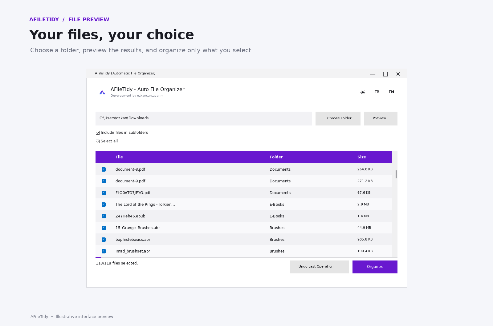
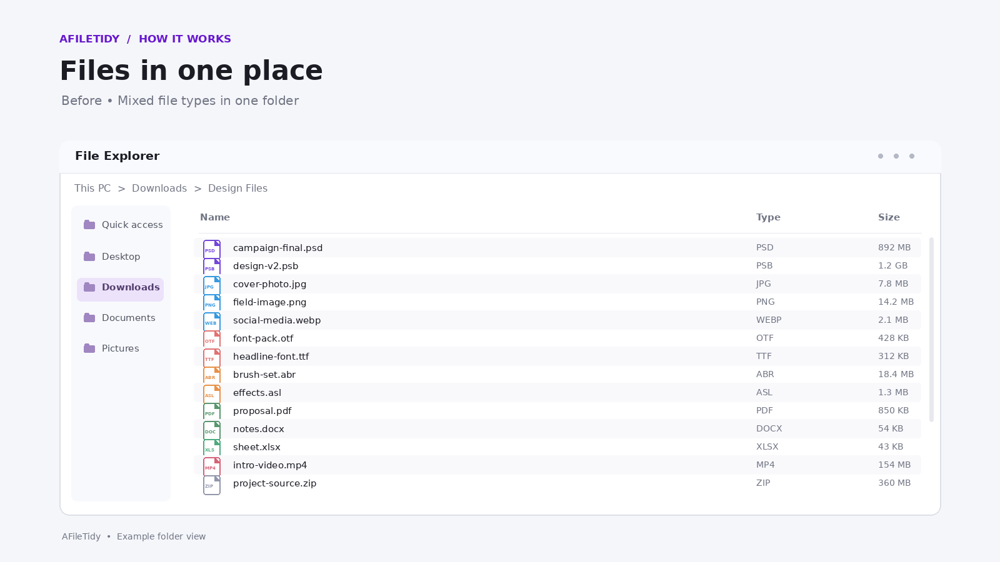
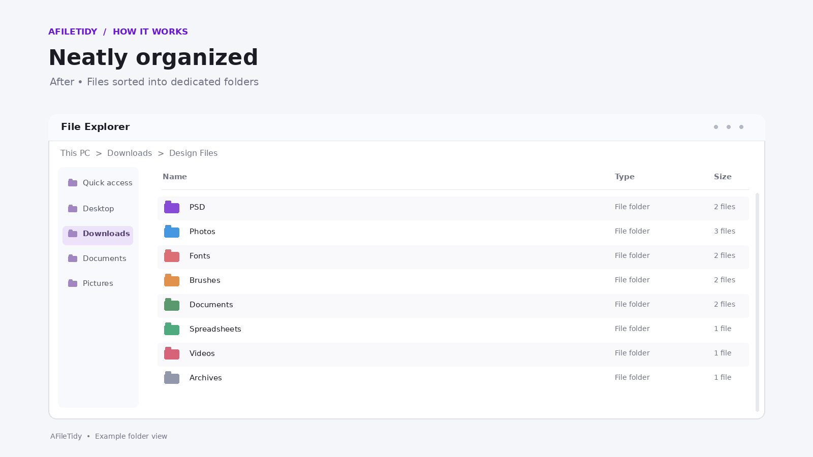

# AFileTidy

<p align="center">
  
</p>

<p align="center">
  <strong>A simple Windows utility that automatically organizes files into folders based on their type.</strong>
</p>

<p align="center">
  Clean up messy folders in seconds — preview, select and organize only the files you want.
</p>

<p align="center">
  <a href="https://github.com/ozkancantasarim/AFileTidy/releases/latest">
    
  </a>
  
  
</p>

---

## About

**AFileTidy** is a lightweight file organization utility for Windows.

Select a folder and AFileTidy automatically detects the files inside it and organizes them into appropriate folders according to their file types.

Instead of manually sorting dozens or hundreds of files, you can preview what will happen, choose which files should be organized and complete the process with a single click.

AFileTidy is designed to be **simple, fast and non-destructive**.

---
## Screenshots

### File Preview

Choose a folder, preview the detected files, and decide exactly what AFileTidy should organize.

<p align="center">
  
</p>

### Before & After

See how AFileTidy turns a folder containing mixed file types into a clean, categorized structure.

<table>
  <tr>
    <td align="center"><strong>Before</strong></td>
    <td align="center"><strong>After</strong></td>
  </tr>
  <tr>
    <td>
      
    </td>
    <td>
      
    </td>
  </tr>
</table>
---
## Download

### Latest version

**[Download AFileTidy](https://github.com/ozkancantasarim/AFileTidy/releases/latest)**

Open the latest release and download:

```text
AFileTidy.exe
```

AFileTidy is portable and does not require installation.
---
## Features

* Automatic file organization
* File type detection
* Preview before organizing
* Individual file selection
* Select all / deselect files
* File size information
* Undo the last organization operation
* Portable `.exe`
* No installation required
* Clean and modern interface
* Designed for Windows 10 and Windows 11

---

## File Categories

AFileTidy can automatically group many common file formats into suitable folders.

Examples include:

| Category          | Examples                                      |
| ----------------- | --------------------------------------------- |
| Images            | JPG, JPEG, PNG, WEBP, GIF, BMP, TIFF          |
| Photoshop         | PSD, PSB                                      |
| Photoshop Brushes | ABR                                           |
| Documents         | PDF, DOC, DOCX, TXT, RTF                      |
| Spreadsheets      | XLS, XLSX, CSV                                |
| Presentations     | PPT, PPTX                                     |
| Videos            | MP4, MKV, AVI, MOV, WEBM                      |
| Audio             | MP3, WAV, FLAC, AAC, OGG                      |
| Archives          | ZIP, RAR, 7Z                                  |
| Fonts             | TTF, OTF                                      |
| Executables       | EXE, MSI                                      |
| Other Files       | Files that do not match a predefined category |

Supported formats may expand in future versions.

---

## How It Works

### 1. Select a folder

Click **Klasör Seç** and choose the folder you want to organize.

### 2. Preview

Click **Önizle**.

AFileTidy scans the selected folder and shows which files will be moved and which categories they belong to.

### 3. Choose files

Every file has its own checkbox.

If there are files you do not want AFileTidy to organize, simply uncheck them.

You can also use **Tümünü Seç** to quickly select or deselect all files.

### 4. Organize

Click **Klasörle**.

AFileTidy creates the required folders and moves the selected files into them.

### 5. Undo if necessary

If you change your mind, use **Son İşlemi Geri Al** to revert the most recent organization operation.

---

## Example

A folder like this:

```text
Downloads/
│
├── poster.psd
├── photo.jpg
├── photo2.png
├── brush.abr
├── video.mp4
├── document.pdf
├── font.ttf
└── archive.zip
```

can automatically become:

```text
Downloads/
│
├── PSD/
│   └── poster.psd
│
├── Photos/
│   ├── photo.jpg
│   └── photo2.png
│
├── Brush/
│   └── brush.abr
│
├── Videos/
│   └── video.mp4
│
├── Documents/
│   └── document.pdf
│
├── Fonts/
│   └── font.ttf
│
└── Archives/
    └── archive.zip
```

---

## Why AFileTidy?

Folders such as **Downloads**, **Desktop**, project directories and asset libraries can quickly become cluttered.

AFileTidy is useful for:

* Designers
* Photographers
* Content creators
* Developers
* Students
* Users with large download folders
* Anyone who regularly works with many different file formats

It is especially useful when working with mixed design assets such as PSD files, images, fonts, brushes, documents and archives.

---

## Portable Application

AFileTidy does not require a traditional installer.

Simply:

1. Download `AFileTidy.exe`
2. Run the application
3. Select a folder
4. Start organizing

You can also keep the application on a USB drive or another portable storage device.

---

## Windows SmartScreen Notice

AFileTidy is currently distributed without a paid code-signing certificate.

Because of this, Windows SmartScreen may display a warning the first time you launch the application.

If the application was downloaded from the official GitHub repository:

```text
https://github.com/ozkancantasarim/AFileTidy
```

you can verify that you are using the official release.

Always download AFileTidy from the repository's **Releases** section.

---

## Safety

AFileTidy does not delete your files during normal organization.

Files are moved into categorized folders inside the location selected by the user.

The preview screen allows you to review the planned operation before making changes.

However, as with any file-management application, keeping backups of important files is recommended.

---

## Updates

New versions of AFileTidy will be published through GitHub Releases.

You can always find the latest version here:

**https://github.com/ozkancantasarim/AFileTidy/releases/latest**

---

## Bug Reports & Suggestions

Found a bug or have an idea for AFileTidy?

You can open an issue:

**https://github.com/ozkancantasarim/AFileTidy/issues**

When reporting a problem, please include:

* A description of the issue
* Steps to reproduce it
* Your Windows version
* A screenshot if possible

---

## Contributing

Suggestions, bug reports and improvements are welcome.

If you would like to contribute:

1. Fork the repository
2. Create a new branch
3. Make your changes
4. Submit a pull request

Please keep changes focused and clearly describe what has been modified.

---

## License

See the [LICENSE](LICENSE) file for licensing information.

---

## Author

Created by **Özkan Can**

GitHub: [@ozkancantasarim](https://github.com/ozkancantasarim)

---

<p align="center">
  <strong>AFileTidy</strong><br>
  Organize your files. Keep your folders clean.
</p>
